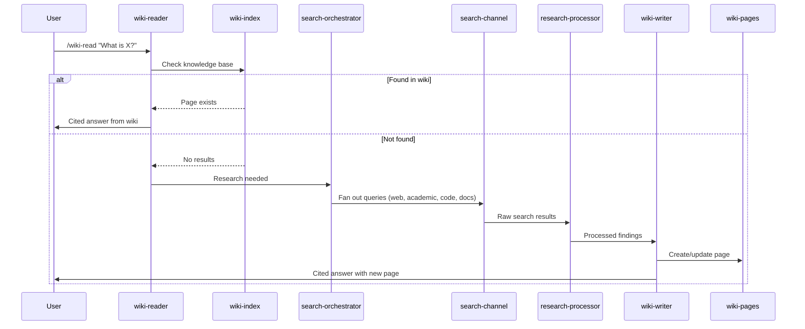
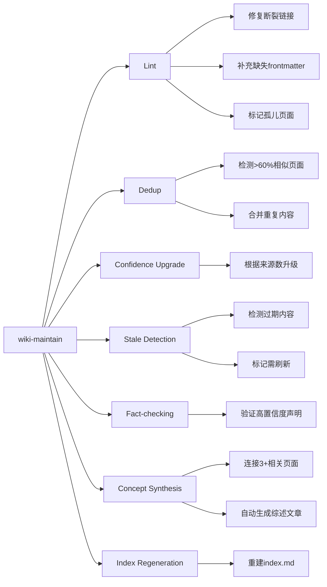
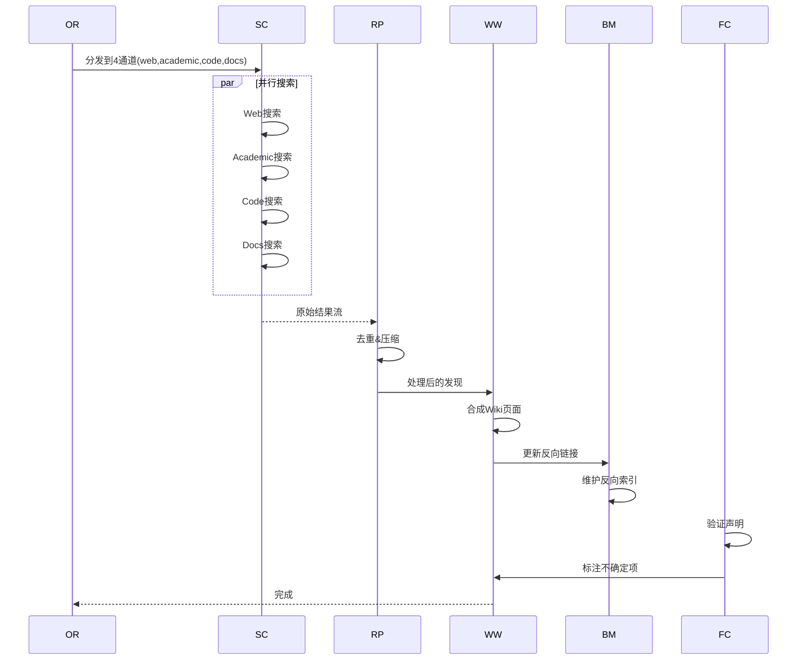

# LLM-Wiki vs 日记系统深度对比分析与优化方案 v2.0

---

## 一、LLM-Wiki 核心设计原理深度剖析

### 1.1 核心理念
> **"An autonomous knowledge base that grows as you work."**
> **"Knowledge compounds over time — the more you use it, the smarter it gets."**

这不是一个文件管理系统，而是一个**知识复合增长系统**。核心洞察：
- 使用过程本身就是知识积累过程
- 查询缺失时自动补全（Research-on-Miss）
- 知识之间自动关联（Backlinks）
- 内容自动维护（Self-maintaining）

### 1.2 Karpathy三层架构模式

```
┌───────────────────────────────────────────────────────────────┐
│                    Raw Sources Layer                           │
│  ┌─────────────────────────────────────────────────────────┐  │
│  │  原始文件不可变（Immutable）                              │  │
│  │  .wiki/raw/web/   - 网页抓取                             │  │
│  │  .wiki/raw/papers/ - PDF论文                             │  │
│  │  .wiki/raw/notes/  - 用户笔记                            │  │
│  │  .wiki/raw/code/   - 代码片段                            │  │
│  │  只读，保证数据完整性和可追溯性                           │  │
│  └─────────────────────────────────────────────────────────┘  │
├───────────────────────────────────────────────────────────────┤
│                    Wiki Layer (LLM-maintained)                 │
│  ┌─────────────────────────────────────────────────────────┐  │
│  │  Wiki层由LLM自动维护                                      │  │
│  │  .wiki/pages/    - Markdown页面（可变）                  │  │
│  │  - 自动分类、自动关联、自动摘要                           │  │
│  │  - 自动更新新鲜度、自动生成反向链接                       │  │
│  │  - 矛盾内容标注双方观点，不静默覆盖                       │  │
│  └─────────────────────────────────────────────────────────┘  │
├───────────────────────────────────────────────────────────────┤
│                    Schema Layer (Rules)                        │
│  ┌─────────────────────────────────────────────────────────┐  │
│  │  规则层定义行为                                           │  │
│  │  .wiki/SCHEMA.md   - 页面格式规则                        │  │
│  │  rules/workflow.md - 工作流规则                          │  │
│  │  - 写入时自动捕获                                        │  │
│  │  - 读取时先查Wiki                                        │  │
│  │  - 矛盾标注不覆盖                                        │  │
│  │  - 反向链接必更新                                        │  │
│  └─────────────────────────────────────────────────────────┘  │
└───────────────────────────────────────────────────────────────┘
```

### 1.3 五大核心机制详解

#### 机制1：Research-on-Miss（查询缺失自动研究）



**关键特点**：
- 不打断用户工作流
- 自动调用可用工具（WebSearch、WebFetch、Wikipedia API、MCP）
- 研究结果自动摄入Wiki
- 多通道并行搜索（web/academic/code/docs）
- 结果去重、压缩、排序

#### 机制2：9-Tier Freshness（九级新鲜度系统）

| Tier | TTL | 适用场景 | 典型内容 |
|:-----|:---:|:---------|:---------|
| `live` | 15分钟 | 超实时数据 | 股价、直播比分、服务器状态 |
| `breaking` | 1-6小时 | 快速演进 | 突发新闻、事故更新、发布公告 |
| `current` | 1-3天 | 时间敏感 | 新闻文章、时事热点 |
| `fast` | 1-4周 | 快速变化领域 | AI/LLM/MCP、API变更、基准测试 |
| `moderate` | 1-3月 | 中等变化率 | 软件版本、框架、库 |
| `standard` | 6月 | 常更新常青 | 通用知识、教程指南（默认） |
| `academic` | 1年 | 稳定研究 | 论文、研究、正式出版物 |
| `evergreen` | 5年 | 缓慢变化 | 历史、传记、定理、法律 |
| `permanent` | 永不 | 不可变 | 个人笔记、想法、记忆、日记 |

**优先级规则**：
```
explicit freshness_tier: > explicit ttl: > auto-classification from tags/type/content
```

#### 机制3：Confidence Tiers（置信度系统）

| Level | 条件 | 含义 |
|:-----|:-----|:-----|
| `low` | 单一来源或推测 | 待验证 |
| `medium` | 2+来源 | 初步确认 |
| `high` | 3+相互印证来源 | 高度可信 |

**置信度升级**：
- 自动检测来源数量
- 定时维护时升级置信度
- 矛盾内容标注双方观点

#### 机制4：Self-Maintaining（自维护）



#### 机制5：Block References & Transclusion（块引用与嵌入）

**语法**：
- `[[page#heading]]` - 链接到页面的特定章节
- `![[page#section]]` - 嵌入整个章节内容

**反向链接**：
- 自动检测未链接的提及（Unlinked Mentions）
- 在页面侧边栏显示反向链接
- 建议用户创建关联

---

### 1.4 10代理协作架构

| Agent | Model | 职责 |
|:------|:-----:|:-----|
| `wiki-writer` | Sonnet | 创建/更新页面，自主摄入 |
| `wiki-reader` | Haiku | 搜索Wiki，合成引用答案，Research-on-Miss |
| `wiki-auditor` | Haiku | Lint、去重、修复断裂链接、升级置信度 |
| `backlink-manager` | Haiku | 维护反向索引、更新related字段、检测未链接提及 |
| `search-orchestrator` | Sonnet | 分类复杂度、分发通道、排序结果 |
| `search-channel` | Haiku | 执行各通道搜索（web/academic/code/docs） |
| `research-loop` | Sonnet | 迭代研究，git回滚（最多3轮） |
| `research-processor` | Haiku | 压缩和去重并行研究结果 |
| `fact-checker` | Sonnet | 验证声明对照外部来源 |
| `citation-explorer` | Sonnet | 学术引用图谱雪球采样 |

**代理协作示例（Deep Research）**：


---

### 1.5 MCP工具集

| Tool | 功能 |
|:-----|:-----|
| `wiki_search` | TF-IDF全文搜索 |
| `wiki_read` | 按slug读取页面 |
| `wiki_write` | 创建或更新页面 |
| `wiki_list` | 列出页面（可按type过滤） |
| `wiki_backlinks` | 获取反向链接+未链接提及 |
| `wiki_stats` | 页面计数、类型/置信度分布 |
| `wiki_query` | Dataview风格frontmatter查询 |
| `wiki_gaps` | 内容缺口分析 |
| `wiki_daily` | 创建/获取今日笔记 |
| `wiki_wikipedia_search` | 搜索Wikipedia |

---

### 1.6 Web UI功能全景

```
/wiki-serve (localhost:8420)
├── 4主题 (light, dark, terminal, wikipedia)
├── 交互式知识图谱 (Cytoscape.js)
├── Canvas/Whiteboard视图
├── 分屏Markdown编辑器 + Live Preview
├── WebSocket聊天 + RAG问答
├── 实时研究（点击红链自动研究）
├── 间隔重复复习 (FSRS)
├── 内容缺口分析Dashboard
├── 反向链接侧边栏
└── 统计和分布可视化
```

---

## 二、当前日记系统架构详解

### 2.1 系统组成

```
日记系统架构
├── 后端服务 (index.js - 2900行)
│   ├── 文件管理API (tree, file, create, move, delete)
│   ├── 虚拟文件夹API (virtual-folders, move, batch-move)
│   ├── AI整理API (organize, classify, tags, related)
│   ├── 图谱API (graph/init, build, network, stats)
│   ├── 搜索API (search, ai/search)
│   ├── 数据管理API (data-save, db-exec)
│   ├── 百度备份API (backup-baidu)
│   ├── 文章收集API (collect-articles, collect-articles-multi)
│   └── 流式API (ai/summary/stream, ai/polish/stream)
│
├── 前端页面 (index.html - 3078行)
│   ├── 文件树视图
│   ├── 虚拟文件夹视图
│   ├── 图谱视图 (vis-network)
│   ├── Markdown编辑器
│   ├── AI整理面板
│   ├── 搜索面板
│   ├── Dashboard统计
│   └── 数据查看器
│
├── AI服务 (ai-service.js - 731行)
│   ├── 分类服务
│   ├── 标签提取
│   ├── 关联分析
│   ├── 摘要生成
│   └── 润色服务
│
├── 数据层
│   ├── diary.db (SQLite - 配置数据)
│   ├── diary-graph.db (SQLite - 图谱数据: 252节点, 508边)
│   ├── virtual-folders.json (虚拟文件夹配置)
│   └── Markdown文件 (.md)
│
└── 定时任务
    ├── 每日物理整理
    ├── 每日AI整理
    ├── 每日图谱重建
    └── 每日记忆同步
```

### 2.2 现有功能清单（详细）

| 功能模块 | API端点 | 状态 | 实现细节 |
|:---------|:--------|:---:|:---------|
| 文件树 | `/api/tree` | ✅ | 递归遍历目录 |
| 文件读取 | `/api/file` | ✅ | Markdown渲染 |
| 文件创建 | `/api/create-file` | ✅ | 支持模板 |
| 文件移动 | `/api/move` | ✅ | 物理移动 |
| 文件删除 | `/api/delete` | ✅ | 安全删除 |
| 虚拟文件夹 | `/api/virtual-folders` | ✅ | JSON配置 |
| 虚拟移动 | `/api/virtual-folders/move` | ✅ | 逻辑移动 |
| 批量虚拟移动 | `/api/virtual-folders/batch-move` | ✅ | 批量处理 |
| AI分类 | `/api/ai/organize/classify` | ✅ | 单文件分类 |
| AI批量分类 | `/api/ai/organize/classify-batch` | ✅ | 批量分类 |
| AI标签提取 | `/api/ai/organize/tags` | ✅ | 4核心标签 |
| AI关联分析 | `/api/ai/organize/related` | ✅ | 相关文件 |
| AI整理文件 | `/api/ai/organize/files` | ✅ | 待整理列表 |
| AI整理应用 | `/api/ai/organize/apply` | ✅ | 应用分类 |
| 图谱初始化 | `/api/graph/init` | ✅ | 初始化数据库 |
| 图谱构建 | `/api/graph/build` | ✅ | 从文件构建 |
| 图谱网络 | `/api/graph/network` | ✅ | vis-network数据 |
| 图谱统计 | `/api/graph/stats` | ✅ | 节点/边计数 |
| 全文搜索 | `/api/search` | ✅ | FTS5中文 |
| AI搜索 | `/api/ai/search` | ✅ | 语义搜索 |
| 百度备份 | `/api/backup-baidu` | ✅ | bdpan CLI |
| 文章收集 | `/api/collect-articles` | ✅ | 单路径 |
| 多路径收集 | `/api/collect-articles-multi` | ✅ | 多来源 |
| 流式摘要 | `/api/ai/summary/stream` | ✅ | SSE流式 |
| 流式润色 | `/api/ai/polish/stream` | ✅ | SSE流式 |

### 2.3 标签系统优化成果

| 指标 | 优化前 | 优化后 | 提升 |
|:-----|:------:|:------:|:----:|
| 边数 | 8881 | 508 | -94% |
| 无效标签 | 多 | 0 | 100% |
| 人名统一 | 无 | 有 | 新增 |
| 频率限制 | 无 | 15/标签 | 新增 |

**标签优化策略**：
```javascript
// 泛化词黑名单
const genericBlacklist = new Set([
  '大学', '用户', '日期', '记录', '任务', '自动', '启动', '发送',
  '助手', '名字', '数字', '成功', '月日', '年月', '文章', '源文件'
]);

// 分词错误黑名单
const segmentationErrors = new Set([
  '万万', '万万万', '万万万万', '元元', '期期', '发者'
]);

// 人名统一映射
const nameMapping = {
  '周泓': '老周', '泓武': '老周', '周泓武': '老周',
  'Minnie': '米妮', '陈玲': 'Migo', '二狗妈': 'Migo'
};

// 频率限制
const MAX_FILES_PER_TAG = 15;
```

---

## 三、深度对比分析

### 3.1 架构理念对比

| 维度 | LLM-Wiki | 日记系统 | 差距分析 |
|:-----|:---------|:---------|:---------|
| **核心理念** | 知识复合增长 | 文件整理管理 | 从"管理"到"增长" |
| **数据哲学** | Raw不可变 | 文件可变 | 数据完整性风险 |
| **维护哲学** | 自维护 | 定时整理 | 从"被动"到"主动" |
| **查询哲学** | Research-on-Miss | 搜索返回空 | 从"缺失"到"补全" |
| **关联哲学** | 强制反向链接 | 图谱边 | 从"手动"到"自动" |

### 3.2 功能对比矩阵（详细）

```
功能                        LLM-Wiki    日记系统    优先级    实施难度
────────────────────────────────────────────────────────────────────
Research-on-Miss              ✅          ❌        🔴高      中等
9级新鲜度系统                 ✅          ❌        🔴高      低
置信度系统                    ✅          ❌        🔴高      低
自维护Lint                    ✅          ⚠️        🔴高      中等
矛盾标注                      ✅          ❌        🔴高      低
反向链接强制更新              ✅          ⚠️        🟡中      中等
块引用 [[file#section]]       ✅          ❌        🟡中      中等
嵌入引用 ![[file#section]]    ✅          ❌        🟡中      中等
未链接提及检测                ✅          ❌        🟡中      中等
Dataview查询语言              ✅          ❌        🟡中      高
间隔重复复习(FSRS)            ✅          ❌        🟢低      高
内容缺口分析                  ✅          ❌        🟢低      中等
WebSocket RAG聊天             ✅          ❌        🟢低      高
知识图谱可视化                ✅          ✅        -        -
全文搜索                      ✅          ✅        -        -
标签系统                      ✅          ✅        -        -
虚拟文件夹                    ❌          ✅        -        -
百度备份                      ❌          ✅        -        -
文章收集                      ❌          ✅        -        -
────────────────────────────────────────────────────────────────────
```

### 3.3 数据层对比

| 层级 | LLM-Wiki | 日记系统 | 差距 |
|:-----|:---------|:---------|:-----|
| **Raw层** | `.wiki/raw/` 不可变 | 无专门Raw层 | ❌ 缺失 |
| **Wiki层** | `.wiki/pages/` LLM维护 | Markdown文件 | ⚠️ 部分 |
| **Schema层** | `SCHEMA.md` 规则定义 | 无 | ❌ 缺失 |
| **Cache层** | SQLite TF-IDF+向量 | SQLite图谱+FTS5 | ⚠️ 部分 |
| **Index层** | `index.md` 自动目录 | 无 | ❌ 缺失 |

### 3.4 元数据对比

**LLM-Wiki Frontmatter**:
```yaml
---
title: "Page Title"
type: concept|entity|source|analysis|idea|status|rules|config|skill|memory
confidence: high|medium|low
sources: [source-slug-1, source-slug-2]
related: [related-slug-1, related-slug-2]
tags: [tag1, tag2]
freshness_tier: standard
created: 2025-01-15
updated: 2025-01-15
---
```

**日记系统 Frontmatter（当前）**:
```yaml
---
source: manual|ai
ai_tags: [tag1, tag2]
ai_category: category_name
ai_summary: summary_text
created: 2026-04-21
---
```

**差距**：
- ❌ 缺少 `type` 字段
- ❌ 缺少 `confidence` 字段
- ❌ 缺少 `freshness_tier` 字段
- ❌ 缺少 `sources` 字段
- ❌ 缺少 `related` 字段（双向链接）

---

## 四、优化方案（分阶段实施）

### 4.1 Phase 1: 核心能力补全（高优先级，2周）

#### 4.1.1 Research-on-Miss API

**设计**：
```javascript
// 新增API端点
POST /api/research
{
  "query": "What is transformer attention?",
  "depth": "standard"  // quick|standard|deep
}

// 响应
{
  "found": false,
  "researched": true,
  "page": {
    "slug": "transformer-attention",
    "title": "Transformer Attention Mechanism",
    "content": "...",
    "sources": ["wikipedia", "arxiv"],
    "confidence": "medium"
  }
}
```

**实施步骤**：
1. 创建 `/api/research` 端点
2. 集成 Tavily/WebSearch
3. 自动创建Wiki页面
4. 返回引用答案

#### 4.1.2 新鲜度系统

**Schema定义**：
```javascript
const FRESHNESS_TIERS = {
  live: { ttl: 15 * 60 * 1000, label: '实时' },        // 15分钟
  breaking: { ttl: 6 * 60 * 60 * 1000, label: '突发' }, // 6小时
  current: { ttl: 3 * 24 * 60 * 60 * 1000, label: '当前' }, // 3天
  fast: { ttl: 4 * 7 * 24 * 60 * 60 * 1000, label: '快速' }, // 4周
  moderate: { ttl: 3 * 30 * 24 * 60 * 60 * 1000, label: '中等' }, // 3月
  standard: { ttl: 6 * 30 * 24 * 60 * 60 * 1000, label: '标准' }, // 6月
  academic: { ttl: 365 * 24 * 60 * 60 * 1000, label: '学术' }, // 1年
  evergreen: { ttl: 5 * 365 * 24 * 60 * 60 * 1000, label: '常青' }, // 5年
  permanent: { ttl: Infinity, label: '永久' }
};
```

**实施步骤**：
1. 扩展frontmatter添加 `freshness_tier`
2. 定时任务检测过期内容
3. Dashboard显示过期提醒
4. AI分类时自动判断新鲜度

#### 4.1.3 置信度系统

**设计**：
```javascript
// 置信度计算
function calculateConfidence(page) {
  const sources = page.sources || [];
  if (sources.length >= 3) return 'high';
  if (sources.length >= 2) return 'medium';
  return 'low';
}
```

**实施步骤**：
1. 扩展frontmatter添加 `confidence`
2. AI整理时记录来源
3. 定时任务升级置信度
4. Dashboard显示置信度分布

#### 4.1.4 自维护Lint

**设计**：
```javascript
// 新增API端点
POST /api/maintenance/lint

// 检查项目
{
  "broken_links": 5,       // 断裂的[[links]]
  "missing_frontmatter": 3, // 缺失frontmatter的文件
  "orphan_pages": 2,        // 无关联的孤立页面
  "duplicate_content": 1,   // >60%相似的重复内容
  "stale_pages": 8          // 过期的页面
}
```

**实施步骤**：
1. 创建Lint检查脚本
2. 集成到每日整理任务
3. Dashboard显示维护报告
4. 自动修复断裂链接

---

### 4.2 Phase 2: 结构化引用（中优先级，1月）

#### 4.2.1 双链引用系统

**语法解析**：
```javascript
function parseWikiLinks(content) {
  // [[file]] -> 链接到文件
  // [[file#section]] -> 链接到章节
  // ![[file#section]] -> 嵌入章节内容
  
  const linkPattern = /\[\[([^\]#]+)(#([^\]]+))?\]\]/g;
  const embedPattern = /!\[\[([^\]#]+)(#([^\]]+))?\]\]/g;
  
  // 返回 { type, target, section }
}
```

**反向链接索引**：
```javascript
// .wiki/backlinks.json
{
  "file-a": {
    "incoming": ["file-b#section", "file-c"],
    "unlinked_mentions": ["file-d内容中提到了file-a"]
  }
}
```

**实施步骤**：
1. 解析Markdown中的Wiki链接
2. 构建反向链接索引
3. 前端显示反向链接面板
4. 检测未链接提及

#### 4.2.2 Dataview查询语言

**语法示例**：
```markdown
```dataview
SELECT title, type, freshness_tier, confidence
FROM pages
WHERE confidence = "high"
AND freshness_tier IN ["current", "fast"]
AND tags CONTAINS "work"
ORDER BY updated DESC
LIMIT 10
```
```

**实施步骤**：
1. 设计查询解析器
2. 实现SELECT/WHERE/ORDER BY
3. 嵌入到Markdown渲染
4. 前端显示查询结果

---

### 4.3 Phase 3: 学习强化（低优先级，3月）

#### 4.3.1 间隔重复复习

**FSRS调度**：
```javascript
// 记录复习状态
{
  "page-slug": {
    "difficulty": 0.3,
    "stability": 3.5,
    "retrievability": 0.9,
    "next_review": "2026-04-25",
    "reviews": [
      { "date": "2026-04-20", "rating": "good" }
    ]
  }
}
```

**实施步骤**：
1. 集成FSRS算法
2. 创建复习队列
3. Dashboard显示复习提醒
4. 标记重要知识点

#### 4.3.2 内容缺口分析

**分析维度**：
```javascript
{
  "missing_pages": ["concept-x", "topic-y"],  // 被引用但不存在
  "depth_gaps": ["topic-z缺少深入分析"],       // 深度不足
  "freshness_gaps": ["8个页面过期"],           // 过期缺口
  "structural_holes": ["cluster-a孤立"],       // 结构空洞
  "coverage": {                                // 覆盖率
    "tags": 0.85,
    "types": 0.70
  }
}
```

**实施步骤**：
1. 分析图谱结构
2. 检测孤立节点
3. 检测缺失页面
4. Dashboard可视化

---

## 五、架构升级蓝图

### 5.1 三层架构重构

```
┌───────────────────────────────────────────────────────────────┐
│                     Schema Layer                               │
│  ┌─────────────────────────────────────────────────────────┐  │
│  │  SCHEMA.md - 页面格式规则                                │  │
│  │  rules.json - 工作流规则                                 │  │
│  │  ┌─────────────────────────────────────────────────┐    │  │
│  │  │  frontmatter规范:                                │    │  │
│  │  │  - type: note/event/task/idea/memory           │    │  │
│  │  │  - confidence: low/medium/high                  │    │  │
│  │  │  - freshness_tier: live/.../permanent          │    │  │
│  │  │  - sources: [source1, source2]                  │    │  │
│  │  │  - related: [[file1]], [[file2#section]]       │    │  │
│  │  │  - tags: [tag1, tag2]                           │    │  │
│  │  └─────────────────────────────────────────────────┘    │  │
│  └─────────────────────────────────────────────────────────┘  │
├───────────────────────────────────────────────────────────────┤
│                     Wiki Layer (LLM-maintained)                │
│  ┌─────────────────────────────────────────────────────────┐  │
│  │  pages/ - Markdown页面（LLM维护）                        │  │
│  │  ┌─────────────────────────────────────────────────┐    │  │
│  │  │  LLM自动维护:                                    │    │  │
│  │  │  - 自动分类（type判断）                          │    │  │
│  │  │  - 自动关联（related更新）                       │    │  │
│  │  │  - 自动摘要（ai_summary）                        │    │  │
│  │  │  - 自动新鲜度（freshness_tier）                  │    │  │
│  │  │  - 自动置信度（confidence计算）                  │    │  │
│  │  │  - 矛盾标注（不静默覆盖）                        │    │  │
│  │  └─────────────────────────────────────────────────┘    │  │
│  └─────────────────────────────────────────────────────────┘  │
├───────────────────────────────────────────────────────────────┤
│                     Raw Layer (Immutable)                      │
│  ┌─────────────────────────────────────────────────────────┐  │
│  │  raw/ - 原始文件（不可变）                               │  │
│  │  ┌─────────────────────────────────────────────────┐    │  │
│  │  │  raw/web/     - 网页抓取（只读）                  │    │  │
│  │  │  raw/notes/   - 用户笔记（只读）                  │    │  │
│  │  │  raw/papers/  - PDF论文（只读）                   │    │  │
│  │  │  raw/code/    - 代码片段（只读）                  │    │  │
│  │  │  raw/transcripts/ - 对话记录（只读）             │    │  │
│  │  │  保证数据完整性和可追溯性                         │    │  │
│  │  └─────────────────────────────────────────────────┘    │  │
│  └─────────────────────────────────────────────────────────┘  │
└───────────────────────────────────────────────────────────────┘
```

### 5.2 数据流重构

```
用户操作/查询
     │
     ▼
┌────────────┐
│ Wiki Layer │ ← LLM处理
└────────────┘
     │
     ├──────────────┬──────────────┬──────────────┐
     ▼              ▼              ▼              ▼
┌─────────┐   ┌─────────┐   ┌─────────┐   ┌─────────┐
│Schema   │   │图谱更新 │   │搜索索引 │   │反向链接 │
│验证    │   │(边创建) │   │(FTS5)  │   │更新    │
└─────────┘   └─────────┘   └─────────┘   └─────────┘
     │              │              │              │
     ▼              ▼              ▼              ▼
┌─────────┐   ┌─────────┐   ┌─────────┐   ┌─────────┐
│Raw层    │   │diary-   │   │FTS5表   │   │backlinks│
│存储    │   │graph.db │   │更新    │   │.json    │
└─────────┘   └─────────┘   └─────────┘   └─────────┘
     │
     ▼
┌────────────────┐
│ 维护任务触发   │
│ - 过期检测    │
│ - 置信度升级  │
│ - 断裂修复    │
└────────────────┘
```

### 5.3 新增API端点清单

| 端点 | 功能 | Phase |
|:-----|:-----|:-----:|
| `/api/research` | Research-on-Miss | 1 |
| `/api/maintenance/lint` | 自维护检查 | 1 |
| `/api/maintenance/dedup` | 去重检测 | 1 |
| `/api/maintenance/stale` | 过期检测 | 1 |
| `/api/freshness/update` | 更新新鲜度 | 1 |
| `/api/confidence/upgrade` | 升级置信度 | 1 |
| `/api/backlinks` | 反向链接 | 2 |
| `/api/backlinks/unlinked` | 未链接提及 | 2 |
| `/api/parse/wiki-links` | Wiki链接解析 | 2 |
| `/api/embed/section` | 嵌入章节 | 2 |
| `/api/dataview/query` | Dataview查询 | 2 |
| `/api/review/queue` | 复习队列 | 3 |
| `/api/review/update` | 更新复习状态 | 3 |
| `/api/gaps/analyze` | 缺口分析 | 3 |

---

## 六、实施路线图

### 6.1 时间线

```
Week 1-2: Phase 1 核心能力
├── Research-on-Miss API
├── 新鲜度Schema
├── 置信度Schema
├── 自维护Lint
└── 集成到每日整理

Week 3-4: Phase 1 完善
├── Dashboard过期提醒
├── Dashboard置信度分布
├── Dashboard维护报告
└── AI分类自动判断新鲜度

Week 5-6: Phase 2 结构化引用
├── Wiki链接解析
├── 反向链接索引
├── 前端反向链接面板
├── 未链接提及检测

Week 7-8: Phase 2 完善
├── Dataview查询解析器
├── Markdown嵌入查询
├── 嵌入章节功能

Week 9-12: Phase 3 学习强化
├── FSRS算法集成
├── 复习队列
├── 缺口分析
├── WebSocket RAG聊天
```

### 6.2 里程碑检查点

| 时间 | 检查点 | 成功标准 |
|:-----|:-----|:---------|
| Week 2 | Research-on-Miss | 查询缺失时自动研究并创建页面 |
| Week 4 | 新鲜度系统 | Dashboard显示过期提醒 |
| Week 6 | 双链引用 | `[[file#section]]` 链接生效 |
| Week 8 | Dataview | 嵌入查询显示结果 |
| Week 12 | 学习系统 | 复习队列和缺口分析 |

---

## 七、总结

### 7.1 核心差距优先级

| 差距 | 影响 | 优先级 | 实施难度 |
|:-----|:-----|:-----:|:--------:|
| Research-on-Miss | 知识无法自动扩展 | 🔴高 | 中等 |
| 新鲜度系统 | 内容过期无法识别 | 🔴高 | 低 |
| 置信度系统 | 知识可信度无法判断 | 🔴高 | 低 |
| 自维护Lint | 需手动维护知识库 | 🔴高 | 中等 |
| 双链引用 | 无法结构化引用 | 🟡中 | 中等 |
| 反向链接 | 无法发现隐含关联 | 🟡中 | 中等 |
| Dataview查询 | 无法结构化查询 | 🟡中 | 高 |
| 间隔重复 | 学习强化缺失 | 🟢低 | 高 |
| 缺口分析 | 知识盲区无法发现 | 🟢低 | 中等 |

### 7.2 核心改进方向

从 **"文件整理系统"** 升级为 **"知识复合增长系统"**：

```
┌──────────────────────────────────────────────────────────┐
│           当前状态 → 目标状态                              │
├──────────────────────────────────────────────────────────┤
│  文件管理        →  知识捕获                              │
│  被动整理        →  主动维护                              │
│  搜索返回空      →  Research-on-Miss                     │
│  手动关联        →  自动反向链接                          │
│  无过期概念      →  9级新鲜度                             │
│  无可信度概念    →  3级置信度                             │
│  图谱静态        →  动态缺口分析                          │
└──────────────────────────────────────────────────────────┘
```

### 7.3 预期收益

| 收益 | 描述 |
|:-----|:-----|
| **知识自动增长** | 查询时自动补全缺失知识 |
| **维护成本降低** | 自维护减少手动干预 |
| **知识质量提升** | 置信度和新鲜度管理 |
| **发现隐含关联** | 反向链接和未链接提及 |
| **学习效果增强** | 间隔重复复习 |
| **盲区可视化** | 缺口分析Dashboard |

---

*分析版本：v2.0*
*分析时间：2026-04-21*
*作者：小貳拾一*
*参考：LLM-Wiki by Oshayr (GitHub)*